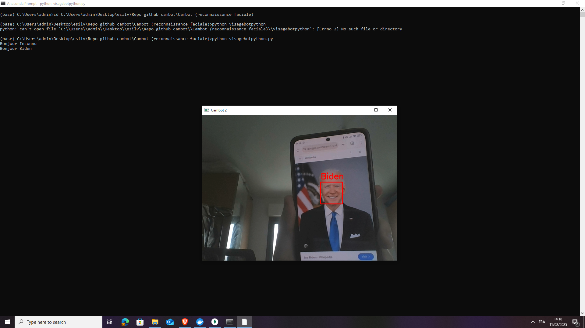
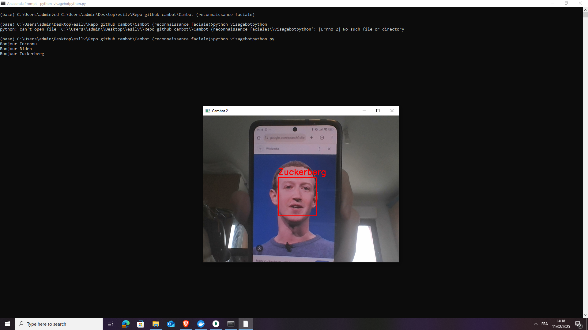

# CamBot-reconnaissance-faciale
Projet personnel pour apprendre à utiliser les librairies OpenCV, Dlib, Face_recognition et utilisé des modèles pré-entrainé avec du ResNET.

## Ajout des visages
Si vous voulez essayer avec votre visage suivez ces étapes :
1. Prenez une image de votre choix
2. Mettez là dans le dossier de cette matière visage/votreprénom**.png**
3. Rajoutez dans le script **visagebotpython.py** la référence dans la partie **charger_visages_connus()**

## Screenshots
Voici une démo du rendu.

##  Auteur
Projet développé par Marwan bns